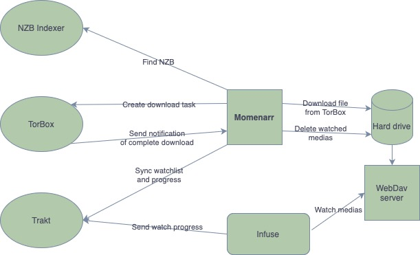

# Momenarr

This is my alternative to Sonarr/Radarr. It's much more lightweight in terms of features but also resources consumption. I run it on my OpenWRT router.
This is very much work in progress, probably very ugly code, I don't know that my first try at writing Go.

## Table of Contents

- [How do it work?](#how-do-it-work)
- [Requirements](#requirements)
- [Container usage](#container-usage)
- [License](#license)

## How do it work?

It uses Trakt watchlist and also watch history. It checks periodically for any updates. It will then search your NZB indexer (newsnab) and send this NZB to TorBox. Once the download is completed on [TorBox](https://torbox.app/), it downloads the file locally. It will also periodically check for your watch history to clean up watched medias.

Very simple diagram explaining how it works:


## Requirements

This is how I use it:
1. I use an newsnab indexer
2. I use TorBox to download nzb
3. I use Infuse (connected to Trakt) to watch my content
4. I created a Trakt application to use its API
5. I download the media locally and expose the medias through [WebDav](https://github.com/amaumene/my_webdav)

You can run the container or compile it locally.
You need to expose the API to the internet so TorBox's webhook can let know Momenarr when the download is finished.

## Container usage

```aiignore
podman run --restart unless-stopped -d --name momenarr \
  -v $WHERE_TO_STORE_MEDIAS:/data \
  -v $WHERE_TO_STORE_DB_AND_TRAKT_TOKEN:/config \
  -e DOWNLOAD_DIR="/data/downloads" \
  -e TEMP_DIR="/data/temp" \
  -e DATA_DIR="/config" \
  -e NEWSNAB_API_KEY="$YOUR_NEWSNAB_API" \
  -e NEWSNAB_HOST="$YOUR_NEWSNAB_HOST" \
  -e TORBOX_API_KEY="$YOUR_TORBOX_API_KEY" \
  -e TRAKT_API_KEY="$YOUR_TRAKT_API_KEY" \
  -e TRAKT_CLIENT_SECRET="$YOUR_TRAKT_CLIENT_SECRET" \
ghcr.io/amaumene/momenarr:main
```

## License

This project is licensed under the GPLv3 License - see the [LICENSE](LICENSE) file for details.
